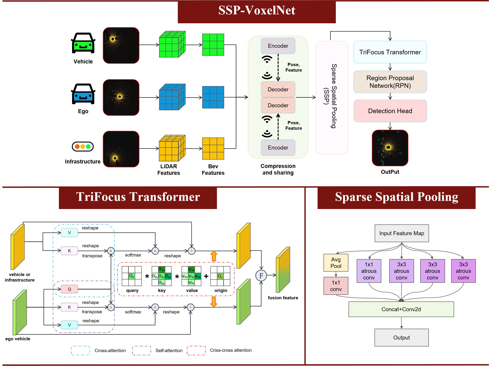

# SSP-VoxelNet

The official implementation of the paper Boosting V2X Cooperative Perception Under Common Corruptions with Transformer.

<p align="center">
<br>
    Visualisation of the intersection under common corruptions.<br>
<br>
    Visualisation of the corridor under common corruptions.
</p>

## Abstract

<p align="center">

</p>
In the realm of vehicle-to-everything (V2X) technology, cooperative perception holds immense promise for enhancing road safety and traffic efficiency. However, the accurate interpretation of shared sensory data in dynamic and complex traffic scenarios remains a significant challenge, particularly under common corruptions such as adverse weather conditions and sensor failures. To this end, we propose a robust V2X perception framework based on the VoxelNet backbone to address these challenges. Our contributions manifest in two key facets. Firstly, we propose a **Sparse Spatial Pooling (SSP)** module, which leverages multiple parallel atrous convolutional layers to enlarge the receptive field. Secondly, we propose an attention model for feature fusion, rooted in the Transformer architecture, termed the **TriFocus Transformer**. This Transformer architecture encompasses self-attention, cross-attention, and criss-cross attention layers, with the primary objective of capturing interaction information across heterogeneous agents to bolster performance under common corruptions. We validate our approach using the V2XSet dataset. Comparative analysis against the state-of-the-art (SOTA) cooperative perception algorithm demonstrates a notable enhancement in average precision across both the perfect setting and common corruptions. For instance, at an IOU threshold of 0.7, the average precision demonstrates improvements ranging from 6.3% to 11.1%.

## Getting Started

### Data Preparation

Please refer to [data introduction](https://opencood.readthedocs.io/en/latest/md_files/data_intro.html#v2xset) to prepare V2XSet.

### Installation

Please refer to [installation guide](https://opencood.readthedocs.io/en/latest/md_files/installation.html) to install OpenCOOD.

 ### Train the Model

There are three settings in basedataset.py, corresponding to **perfect setting**, **weather corruption** and **sensor corruption**.

```python
def retrieve_base_data(self, idx, cur_ego_pose_flag=True):
	......
	# perfect setting
	data[cav_id]['lidar_np'] = \
                pcd_utils.pcd_to_np(cav_content[timestamp_key_delay]['lidar'])
    
    # weather corruption
    data[cav_id]['lidar_np'] = \
                scene_glare_noise(pcd_utils.pcd_to_np(cav_content[timestamp_key_delay]['lidar']), 1)
                
    # sensor corruption
   	data[cav_id]['lidar_np'] = \
                gaussian_noise(pcd_utils.pcd_to_np(cav_content[timestamp_key_delay]['lidar']), 5)
```

We set the compression rate to 32, then trained directly under the **perfect setting** without fine-tuning. We used three GPUs at the same time for one training session, running one batch size per graphics card. To train the model, run the following command.

```
CUDA_VISIBLE_DEVICES=1,2,3 python -m torch.distributed.launch --nproc_per_node=3 --master_port='29501' --use_env opencood/tools/train.py --hypes_yaml opencood/hypes_yaml/voxelnet_ssp.yaml
```

### Test the Model

We tested under the **perfect setting** and **common corruptions**. First you need to make sure that the settings in basedataset.py are correct, then put the config.yaml and the model file in the same folder, and finally run the following code for testing.

```
python opencood/tools/inference.py --model_dir ${CHECKPOINT_FOLDER} --fusion_method ${FUSION_STRATEGY} [--save_npy]
```

Arguments Explanation:

+ `model_dir`: the path to your saved model.

+ `fusion_method`: indicate the fusion strategy, currently support 'early', 'late', and 'intermediate'.

+ `save_npy`: whether to save prediction and gt result in npy_test file.

## Benchmark

### Results of 3D Detection under the Perfect Setting

|                        Model                         |    Source    |  AP@0.5   |  AP@0.7   |                        Download Link                         |
| :--------------------------------------------------: | :----------: | :-------: | :-------: | :----------------------------------------------------------: |
|     [F-Cooper](https://arxiv.org/abs/1909.06459)     |   SEC2019    |   0.840   |   0.680   |                                                              |
| [Attentive Fusion](https://arxiv.org/abs/2109.07644) |   ICRA2022   |   0.807   |   0.664   |                                                              |
|      [V2VNet](https://arxiv.org/abs/2008.07519)      |   ECCV2020   |   0.845   |   0.677   |                                                              |
|     [DiscoNet](https://arxiv.org/abs/2109.11615)     | NeurIPS2021  |   0.844   |   0.695   |                                                              |
|      [CoBEVT](https://arxiv.org/abs/2207.02202)      |   CoRL2022   |   0.849   |   0.660   |                                                              |
|    [Where2Comm](https://arxiv.org/abs/2209.12836)    | NeurIPS 2022 |   0.855   |   0.654   |                                                              |
|   [V2X-ViT](https://arxiv.org/pdf/2203.10638.pdf)    |   ECCV2022   |   0.882   |   0.712   |                                                              |
|                     SSP-VoxelNet                     |              | **0.888** | **0.823** | [url](https://drive.google.com/drive/folders/1_SENTuM0YmMvfROOZg8xixgL-CyzYqye) |

### Results of 3D Detection under Common Corruptions

|                      Model                      | Weather Corruption AP@0.3 | Weather Corruption AP@0.5 | Weather Corruption AP@0.7 | Sensor Corruption AP@0.3 | Sensor Corruption AP@0.5 | Sensor Corruption AP@0.7 |                        Download Link                         |
| :---------------------------------------------: | :-----------------------: | :-----------------------: | :-----------------------: | :----------------------: | :----------------------: | :----------------------: | :----------------------------------------------------------: |
| [Where2Comm](https://arxiv.org/abs/2209.12836)  |           0.494           |           0.430           |           0.162           |          0.499           |          0.427           |          0.155           | [url1](https://drive.google.com/drive/folders/1v7lnPIIAXx9MDM1V8Z2ufYEw72_n1Lga?usp=drive_link)/[url2](https://drive.google.com/drive/folders/1GhJCR-_PXf0GHNnHANp-d3ViGzYiEaRM?usp=drive_link) |
|   [V2VNet](https://arxiv.org/abs/2008.07519)    |           0.795           |           0.746           |           0.454           |          0.845           |          0.806           |          0.494           | [url1](https://drive.google.com/drive/folders/1YZJDPo_MC1H3iKROPZAHgSOm0M3K0AEO?usp=drive_link)/[url2](https://drive.google.com/drive/folders/1igtUHyaCHUpppXs7NCg2V5_qyNSoPilJ?usp=drive_link) |
|  [F-Cooper](https://arxiv.org/abs/1909.06459)   |           0.855           |           0.842           |           0.707           |          0.862           |          0.847           |          0.720           | [url](https://drive.google.com/drive/folders/1azJBhmluImJCUMme3HvOE3zsIHrJwmS3?usp=drive_link) |
| [V2X-ViT](https://arxiv.org/pdf/2203.10638.pdf) |           0.857           |           0.841           |           0.698           |          0.856           |          0.842           |          0.692           | [url1](https://drive.google.com/drive/folders/1Hinfv-uRqmZrf4R4A-49KdEwPhZzJlCc?usp=drive_link)/[url2](https://drive.google.com/drive/folders/1ZXHHIU17m14OniwW1A-6hVdaojIM1Xxr?usp=drive_link) |
|   [CoAlign](https://arxiv.org/abs/2211.07214)   |           0.854           |           0.831           |           0.706           |          0.863           |          0.843           |          0.729           | [url](https://drive.google.com/drive/folders/16Lu7lpUcgfOMVyV1XNGv4sxGXqlj15r_?usp=drive_link) |
|                  SSP-VoxelNet                   |         **0.864**         |         **0.854**         |         **0.780**         |        **0.881**         |        **0.872**         |        **0.792**         | [url](https://drive.google.com/drive/folders/1_SENTuM0YmMvfROOZg8xixgL-CyzYqye) |

In the download link, "url1" denotes the optimal model under weather corruption, "url2" denotes the optimal model under sensor corruption, and "url" denotes the optimal model under both corruptions.
